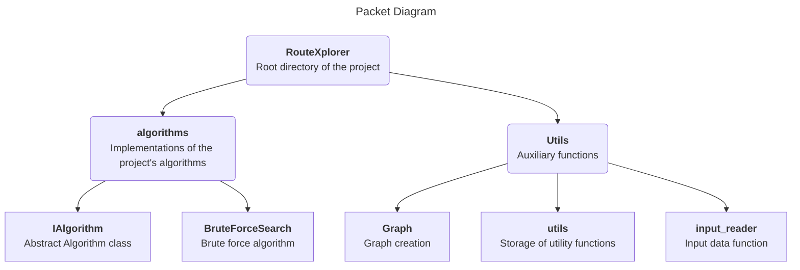

<p align="center">
  
</p>

<br>
<br>

[](https://www.python.org/downloads/release/python-300/)
[](https://opensource.org/licenses/MIT)
[](https://github.com/vsg-root/RouteXplorer)
[](https://pypi.org/project/routexplorer/#description)

RouteXplorer is a Python library developed to solve the Traveling Salesman Problem (TSP) in complete graphs. Its goal is to find the most efficient sequence of visiting nodes in a graph, minimizing the total distance traveled.
<br>

## Install

```python
$ pip install routexplorer
```

##### Try your first RouteXplorer program
```python
# Create a .py file
$ echo > PythonFile.py
$ open PythonFile.py
```
With this piece of code you can read a input file, convert it into a graph and calculate the best path using the brute force algorithm.
```python
>>> from routexplorer.utils.input_reader import InputReader
>>> from routexplorer.algorithms.BruteForceSearch import BruteForceSearch

>>> # Datas of graph
>>> graph = InputReader.read_file(input("Enter file path: ")) 

>>> # Calculation of the best path and distance
>>> best_path, best_distance = BruteForceSearch.find_best_path(graph, show_load=True, show_result=True)
```
Alternatively you can get the input directly with the final user and omit the loading process.
```python
>>> from routexplorer.utils.input_reader import InputReader
>>> from routexplorer.utils.Graph import Graph
>>> from routexplorer.algorithms.BruteForceSearch import BruteForceSearch

>>> # Datas of graph
>>> graph = Graph(InputReader.get_vertices(InputReader.get_map_size(input()), input_function=input))

>>> # Calculation of the best path and distance
>>> best_path, _ = BruteForceSearch.find_best_path(graph)

>>> path_length = len(best_path)
>>> for i in range(path_length):
>>>     print(best_path[i], end=" " if i < path_length - 1 else "\n")
```

##### Create a .txt file
If you want, you can create a input file to facilitate the graph creation. This step can be achieved alternatively using other methods without the need to create a input file.
```bash
$ echo > file.txt
$ open file.txt
```
The file must have the following format:
```bash
4 5
0 0 0 0 D
0 A 0 0 0
0 0 0 0 C
R 0 B 0 0
```
The first row represents the size of the map and the following rows represents the map itself. each one of the characters is a cell, the 0's are empty cell's, you can change these characters for anything you want, as long as it isn't a letter, the letters represents a node. 

##### Run your project
```python
$ python RouteXplorer.py
Enter file path: your/txt/file/path/file.txt
```
```
100% [■■■■■■■■■■] - Generating permutations
100% [■■■■■■■■■■] - Checking paths
Best path: ['A', 'D', 'C', 'B'] 
Shorter distance: (14)
```
Or if you have chosed the second code example:
 ```python
$ python RouteXplorer.py
4 5
0 0 0 0 D
0 A 0 0 0
0 0 0 0 C
R 0 B 0 0
```
```
A D C B
```
## Library Architecture

## Key Features

- Efficient Algorithms: RouteXplorer implements a variety of optimized algorithms to solve the Traveling Salesman Problem, allowing you to find solutions quickly and efficiently.

- Flexible Customization: The library offers flexible options to customize the algorithm settings, allowing you to adapt the optimization process to the specific needs of your project.

- Simple Integration: The library is easy to integrate into your existing Python projects, allowing you to leverage its powerful functionality without complications.


## Contribution

RouteXplorer is an open source project and we encourage community contributions. If you want to contribute, please follow the guidelines outlined in the repository's CONTRIBUTING.md file.

## License

RouteXplorer is distributed under the MIT license. For more information, see the LICENSE.md file.
